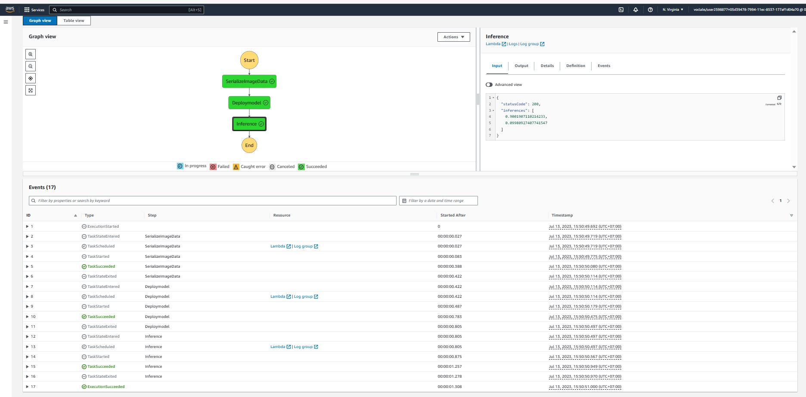

# Build-a-ML-Workflow-For-Scones-Unlimited-On-Amazon-SageMaker
The primary objective of this project was to build and deploy an image classification model for Scones Unlimited, a scone-delivery-focused logistic company, using AWS SageMaker.

## 1. Overview

This project was a part of the project assessment in the **'AWS x Udacity's Machine Learning Engineer Nanodegree Program'**.


### 2. Project files related information:

**1. `starter.ipynb`:** Jupyter notebook showcases a machine learning working workflow for Image Classification. This includes the necessary preprocessing of the scones unlimited image dataser, model training, deployment and monitor using Amazon SageMaker and other associated AWS Services.<br><br>
**2. `starter.html`:** Web-page displaying 'starter.ipynb'<br><br>
**3. `**.py` script:** `scripts used by three AWS Lambda functions to create a Step Functions workflow` <br><br>
**4. `StepFunction.PNG`:** screen capture of working step function. <br><br>
**5. `step-function.json`:** Step Function exported to JSON<br><br>

### 3. Dependencies
```
Python 3 (Data Science) - v3.7.10 kernel
ml.t3.medium instance
Python 3.8 runtime for the AWS Lambda Functions
```

## 4. Approach:

The project aims to develop an image classification Machine Learning Model using workflows on Amazon SageMaker, automating various Machine Learning tasks such as Data Preparation, Model Training, Deployment, and Inference with the help of AWS Step Functions and Lambda functions.

### 3.1. Individual AWS Lambda functions drafted to build an AWS Step Functions Workflow:<br>

1. The `serializeImageData` Lambda Function (takes the address of an image hosted in S3, and returns a serialized JSON object.<br>
2. The `DeployModel` Lambda Function accepts the JSON object obtained from step 1 and sends it to an endpoint, collecting inferences as a JSON object.<br>
3. The `Inference` Lambda Function takes the inference data from step 2, and filters only the images that meet the pre-defined threshold.<br>

### 3.2. Building a State Machine via AWS Step Functions


#### 3.2.1. Step Function Graph


#### 3.2.2. Execution Flow of the Step Function 




