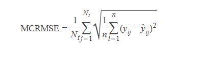

# Capstone Project Proposal: Feedback Prize - English Language Learning

<p style="text-align: center;">July 18, 2023</p>


**1. Udacity Machine Learning Engineer Nanodegree**
- Author: NGUYEN DUC HUY
- Project from the Kaggle competition: [Feedback Prize - English Language Learning](https://www.kaggle.com/competitions/feedback-prize-english-language-learning)
- Field: Natural Language Processing

**2. Domain Background**

From [Kaggle competition page](https://www.kaggle.com/competitions/feedback-prize-english-language-learning) :

Writing is a foundational skill. Sadly, it's one few students are able to hone, often because writing tasks are infrequently assigned in school. A rapidly growing student population, students learning English as a second language, known as English Language Learners (ELLs), are especially affected by the lack of practice. While automated feedback tools make it easier for teachers to assign more writing tasks, they are not designed with ELLs in mind.

Existing tools are unable to provide feedback based on the language proficiency of the student, resulting in a final evaluation that may be skewed against the learner. Data science may be able to improve automated feedback tools to better support the unique needs of these learners.

Competition host Vanderbilt University is a private research university in Nashville, Tennessee. It offers 70 undergraduate majors and a full range of graduate and professional degrees across 10 schools and colleges, all on a beautiful campus—an accredited arboretum—complete with athletic facilities and state-of-the-art laboratories. Vanderbilt is optimized to inspire and nurture cross-disciplinary research that fosters discoveries that have global impact. Vanderbilt and co-host, The Learning Agency Lab, an independent nonprofit based in Arizona, are focused on developing science of learning-based tools and programs for social good.

Vanderbilt and The Learning Agency Lab have partnered together to offer data scientists the opportunity to support ELLs using data science skills in machine learning, natural language processing, and educational data analytics. You can improve automated feedback tools for ELLs by sensitizing them to language proficiency. The resulting tools could serve teachers by alleviating the grading burden and support ELLs by ensuring their work is evaluated within the context of their current language level.

**3. Problem Statement**

From [Kaggle competition page](https://www.kaggle.com/competitions/feedback-prize-english-language-learning):

The goal of this competition is to assess the language proficiency of 8th-12th grade English Language Learners (ELLs). Utilizing a dataset of essays written by ELLs will help to develop proficiency models that better supports all students.

Your work will help ELLs receive more accurate feedback on their language development and expedite the grading cycle for teachers. These outcomes could enable ELLs to receive more appropriate learning tasks that will help them improve their English language proficiency.

**4. Datasets and Inputs**

The dataset presented here (the ELLIPSE corpus) comprises argumentative essays written by 8th-12th grade English Language Learners (ELLs). The essays have been scored according to six analytic measures: cohesion, syntax, vocabulary, phraseology, grammar, and conventions.

Each measure represents a component of proficiency in essay writing, with greater scores corresponding to greater proficiency in that measure. The scores range from 1.0 to 5.0 in increments of 0.5. Your task is to predict the score of each of the six measures for the essays given in the test set.

Some of these essays have appeared in the datasets for the Feedback Prize - Evaluating Student Writing and Feedback Prize - Predicting Effective Arguments competitions. You are welcome to make use of these earlier datasets in this competition.

**File and Field Information**

- train.csv - The training set, comprising the full_text of each essay, identified by a unique text_id. The essays are also given a score for each of the seven analytic measures above: cohesion, etc. These analytic measures comprise the target for the competition.
- test.csv - For the test data we give only the full_text of an essay together with its text_id.
- sample_submission.csv - A submission file in the correct format. See the Evaluation for details.

Please note that this is a Code Competition. We give a few sample essays in test.csv to help you author your solutions. When your submission is scored, this example test data will be replaced with the full test set. The full test set comprises about 2700 essays.

**5. Solution Statement**

In this competition, the learning problem is multi-output regression, where the number of output variables is 6 (as the score for each analytic measures: cohesion, syntax ,vocabulary , phraseology, grammar, conventions), and the input is text.

Existing methods for multi-output regression can be categorized as follows:

a. Problem transformation methods (also known as local methods) that transform the multi-output problem into independent single-output problems, each solved using a single-output regression algorithm.

b. Algorithm adaptation methods that adapt a specific single-output method (such as decision trees and support vector machines) to directly handle multi-output datasets. Algorithm adaptation methods are deemed to be more challenging since they not only aim to predict the multiple targets but also to model and interpret the dependencies among these targets.

c. The multi-task learning approach is related to the multi-output regression problem, as it also aims to learn multiple related tasks (i.e., outputs) simultaneously.

In this project, I will apply the b. algorithm adaptation methods and c. the multi-task learning approach to solve the problem. The text should be preprocessed to be cleaned and transformed into the standard format. In approach b., the "clean" text will be embedded into vectors using different techniques, such as TF-IDF, Word2Vec, Transformer-based embedding, etc. The embedding vectors will then be fed into classical ML models (Random Forest, XGBoost, etc.) for regression tasks.

In approach c., we will build an end-to-end model based on Deep Neural Networks. The last layer will have the number of nodes equal to the number of outputs in the problem.

There will be different models suitable for regression, and during the Model Building phase, I will have to evaluate the ML algorithms to decide which one to use. Deep Neural Networks like BERT and RoBERTa are among the models I am considering for evaluation.


**6. Benchmark Model**

Submissions to this competition must be made through Notebooks. In order for the "Submit" button to be active after a commit, the following conditions must be met:

- CPU Notebook <= 9 hours run-time
- GPU Notebook <= 9 hours run-time
- Internet access disabled
- Freely & publicly available external data is allowed, including pre-trained models
- Submission file must be named submission.csv

**7. Evaluation Metrics**

As any other Kaggle competition, submissions will be benchmarked against the test set that are scored using MCRMSE, mean columnwise root mean squared error:

<!-- $MCRMSE = \frac{1}{N_{t}} \sum_{j=1}^{N_{t}} \sqrt{\frac{1}{n} \sum_{i=1}^{n}\left(y_{i j}-\hat{y}_{i j}\right)^{2}}$ -->


where Nt is the number of scored ground truth target columns, and y and $
\hat{y}$  are the actual and predicted values, respectively.

**8. Submission File**

For each text_id in the test set, you must predict a value for each of the six analytic measures (described on the Data page). The file should contain a header and have the following format:
<!-- ```python
|text_id|cohesion|syntax|vocabulary|phraseology|grammar|conventions|
|000BAD50D026|3.0|3.0|3.0|3.0|3.0|3.0|
|00367BB2546B|3.0|3.0|3.0|3.0|3.0|3.0|
|003969F4EDB6|3.0|3.0|3.0|3.0|3.0|3.0|
``` -->
| text_id | cohesion | syntax | vocabulary | phraseology | grammar | conventions |
| ------------- | ----- | ----- |----- |----- |----- |----- |
| 000BAD50D026 | 3.0 | 3.0 | 3.0 | 3.0 | 3.0 | 3.0 |
| 00367BB2546B | 3.0 | 3.0 | 3.0 | 3.0 | 3.0 | 3.0 |
| 003969F4EDB6 | 3.0 | 3.0 | 3.0 | 3.0 | 3.0 | 3.0 |


**9. Project Design**

Following are the high level steps I’m planning to take to build a toxic content classification algorithm:
- Exploring data and collecting key metrics
- Definition of evaluation metrics
- Transformation
- Model selection and building
- Training, evaluation and fine tuning the model
- Kaggle submission


**10. Other Resources**

- Borchani, H., Varando, G., Bielza, C. and Larranaga, P., 2015. A survey on multi‐output regression. Wiley Interdisciplinary Reviews: Data Mining and Knowledge Discovery, 5(5), pp.216-233.
- Baxter J. A Bayesian/information theoretic model of learning to learn via multiple
task sampling. Mach. Learn. 1997, 28(1):7–39.
- Caruana R. Multitask learning. Mach. Learn. 1997, 28(1):41–75.
- Ben-David S, Schuller R. Exploiting task relatedness for multiple task learning.
In: Proceedings of the Sixteenth Annual Conference on Learning Theory, Springer
Verlag, Washington, DC; 2003, 567–580.
- Devlin, J., Chang, M.W., Lee, K. and Toutanova, K., 2018. Bert: Pre-training of deep bidirectional transformers for language understanding. arXiv preprint arXiv:1810.04805.
- Liu, Y., Ott, M., Goyal, N., Du, J., Joshi, M., Chen, D., Levy, O., Lewis, M., Zettlemoyer, L. and Stoyanov, V., 2019. Roberta: A robustly optimized bert pretraining approach. arXiv preprint arXiv:1907.11692.
- Chen, T., He, T., Benesty, M., Khotilovich, V., Tang, Y., Cho, H., Chen, K., Mitchell, R., Cano, I. and Zhou, T., 2015. Xgboost: extreme gradient boosting. R package version 0.4-2, 1(4), pp.1-4.
- Church, K.W., 2017. Word2Vec. Natural Language Engineering, 23(1), pp.155-162.
- Almeida, F. and Xexéo, G., 2019. Word embeddings: A survey. arXiv preprint arXiv:1901.09069.

