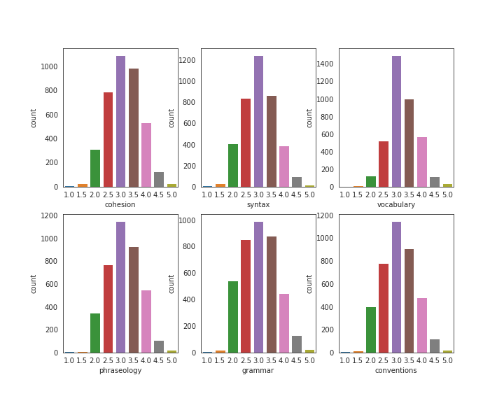
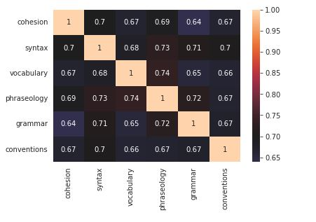
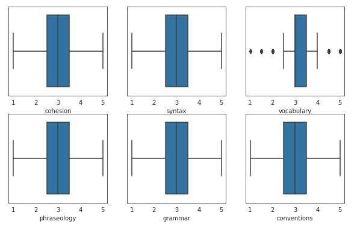
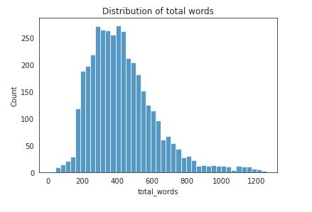

# Udacity Machine Learning Engineer Nanodegre


<p style="text-align: center;; font-size: 24px">Capstone Project: Feedback Prize - English Language Learning </p>

<p style="text-align: center;"> August 03, 2023</p>


- Author: NGUYEN DUC HUY
- Project from the Kaggle competition: [Feedback Prize - English Language Learning](https://www.kaggle.com/competitions/feedback-prize-english-language-learning)
- Field: Natural Language Processing

## Project Overview

From [Kaggle competition page](https://www.kaggle.com/competitions/feedback-prize-english-language-learning) :

Writing is a foundational skill. Sadly, it's one few students are able to hone, often because writing tasks are infrequently assigned in school. A rapidly growing student population, students learning English as a second language, known as English Language Learners (ELLs), are especially affected by the lack of practice. While automated feedback tools make it easier for teachers to assign more writing tasks, they are not designed with ELLs in mind.

Existing tools are unable to provide feedback based on the language proficiency of the student, resulting in a final evaluation that may be skewed against the learner. Data science may be able to improve automated feedback tools to better support the unique needs of these learners.

Competition host Vanderbilt University is a private research university in Nashville, Tennessee. It offers 70 undergraduate majors and a full range of graduate and professional degrees across 10 schools and colleges, all on a beautiful campus—an accredited arboretum—complete with athletic facilities and state-of-the-art laboratories. Vanderbilt is optimized to inspire and nurture cross-disciplinary research that fosters discoveries that have global impact. Vanderbilt and co-host, The Learning Agency Lab, an independent nonprofit based in Arizona, are focused on developing science of learning-based tools and programs for social good.

Vanderbilt and The Learning Agency Lab have partnered together to offer data scientists the opportunity to support ELLs using data science skills in machine learning, natural language processing, and educational data analytics. You can improve automated feedback tools for ELLs by sensitizing them to language proficiency. The resulting tools could serve teachers by alleviating the grading burden and support ELLs by ensuring their work is evaluated within the context of their current language level.

## Problem Statement 

From [Kaggle competition page](https://www.kaggle.com/competitions/feedback-prize-english-language-learning):

The goal of this competition is to assess the language proficiency of 8th-12th grade English Language Learners (ELLs). Utilizing a dataset of essays written by ELLs will help to develop proficiency models that better supports all students.

Your work will help ELLs receive more accurate feedback on their language development and expedite the grading cycle for teachers. These outcomes could enable ELLs to receive more appropriate learning tasks that will help them improve their English language proficiency.

## Evaluation Metrics

As any other Kaggle competition, submissions will be benchmarked against the test set that are scored using MCRMSE, mean columnwise root mean squared error:

<!-- $MCRMSE = \frac{1}{N_{t}} \sum_{j=1}^{N_{t}} \sqrt{\frac{1}{n} \sum_{i=1}^{n}\left(y_{i j}-\hat{y}_{i j}\right)^{2}}$ -->


where Nt is the number of scored ground truth target columns, and y and $
\hat{y}$  are the actual and predicted values, respectively.


## Analysis
### Data Exploration
In this section, I conduct a thorough data analysis, refining the dataset through cleaning and preprocessing. Through a variety of visualizations like scatter plots, histograms, and correlations, I uncover patterns and relationships within the data. These visuals offer insights into distributions, interdependencies, and anomalies.

#### Score of student 

Exploring the distribution of student scores across various evaluation criteria, such as 'cohesion,' 'syntax,' 'vocabulary,' 'phraseology,' 'grammar,' and 'conventions,' provides a fascinating insight into the performance patterns within the student dataset.

By examining the distribution of scores, we gain a visual representation of how students are performing across these distinct aspects of their work. This process involves analyzing how frequently certain score ranges or intervals appear for each criterion. For instance, we can identify whether students tend to excel in 'vocabulary' but struggle with 'grammar,' or if there's a consistent balance among different criteria



The above Fig shows that:
- Scores of the students are completely normally distributed
- Ideal range is 2.0-4.0

#### Correlation heatmap

The figure demonstrates a positive correlation among 'cohesion,' 'syntax,' 'vocabulary,' 'phraseology,' 'grammar,' and 'conventions.' This means that as scores rise in one area, they also tend to rise in the others. This suggests students with strengths in one linguistic aspect typically excel in the rest as well. Such consistency has implications for teaching, predicting performance, and designing comprehensive language interventions.




#### Boxplot 
The depicted figure indicates that 'cohesion,' 'syntax,' 'phraseology,' 'grammar,' and 'conventions' lack outliers. However, 'vocabulary' displays outliers, which warrants a thorough examination of the underlying data.




#### Distrubtion of total words 

The visual representation presented in the figure above vividly illustrates that the distribution of the total number of words in the essays is skewed. This type of distribution is characterized by one tail of the distribution being longer than the other. In this case, the tail towards the higher end of the word count spectrum appears more extended compared to the lower end.

The mean value, which represents the average word count across all the essays, is calculated to be around 400 words. This metric provides a central point around which the word counts are clustered. 

It's noticeable from the figure that only a small proportion of essays possess word counts exceeding 800 words. These essays, with their notably greater length, stand out as exceptions in the dataset. In contrast, the bulk of the essays fall within a range of 200 to 600 words. This range encapsulates the majority of essays and represents the typical length observed. 

In summary, the figure provides valuable insights into the distribution of total word counts in the essays. It highlights the skewness, the mean word count around 400, the rarity of essays with over 800 words, and the prevalent range of 200 to 600 words in most essays."




## Algorithms and Techniques

In this competition, the learning problem is multi-output regression, where the number of output variables is 6 (as the score for each analytic measures: cohesion, syntax ,vocabulary , phraseology, grammar, conventions), and the input is text.

Existing methods for multi-output regression can be categorized as follows:

a. Problem transformation methods (also known as local methods) that transform the multi-output problem into independent single-output problems, each solved using a single-output regression algorithm.

b. Algorithm adaptation methods that adapt a specific single-output method (such as decision trees and support vector machines) to directly handle multi-output datasets. Algorithm adaptation methods are deemed to be more challenging since they not only aim to predict the multiple targets but also to model and interpret the dependencies among these targets.

c. The multi-task learning approach is related to the multi-output regression problem, as it also aims to learn multiple related tasks (i.e., outputs) simultaneously.

In this project, I will apply the b. algorithm adaptation methods. The text should be preprocessed to be cleaned and transformed into the standard format. In approach b., the "clean" text will be embedded into vectors using different techniques, such as TF-IDF, Word2Vec, Transformer-based embedding, etc. The embedding vectors will then be fed into classical ML models (Random Forest, XGBoost, etc.) for regression tasks.

There will be different models suitable for regression, and during the Model Building phase, I will have to evaluate the ML algorithms to decide which one to use. 


## Benchmark

Submissions to this competition must be made through Notebooks. In order for the "Submit" button to be active after a commit, the following conditions must be met:

- CPU Notebook <= 9 hours run-time
- GPU Notebook <= 9 hours run-time
- Internet access disabled
- Freely & publicly available external data is allowed, including pre-trained models
- Submission file must be named submission.csv

## Methodology

### Data pipeline
I used a feature extraction technique CountVectorizer() to convert a collection of text documents into a matrix of token counts. It's a way to represent text data numerically, which is necessary for many machine learning algorithms that expect numerical inputs. Each row of the resulting matrix corresponds to a document, and each column corresponds to a unique word (or "token") in the entire collection of documents. The value at a particular row and column represents how many times that word appears in the corresponding document.

Then I applied Term Frequency-Inverse Document Frequency Transformer TfidfTransformer(). It's another step in the text processing pipeline that follows the CountVectorizer. While the CountVectorizer counts the occurrences of words in documents, the TF-IDF transformation takes it a step further by considering the importance of words in the context of the entire corpus (collection of documents). For more details:

- Term Frequency (TF): This measures how often a word appears in a document. It's calculated as the ratio of the number of times a word appears in a document to the total number of words in that document.

- Inverse Document Frequency (IDF): This measures the significance of a word in the entire corpus. Words that appear frequently across all documents are considered less informative, so their IDF score is lower. Words that are rare but appear in specific documents are considered more significant, so their IDF score is higher.

- TF-IDF: The TF-IDF score of a word in a document is the product of its Term Frequency and Inverse Document Frequency. It gives a higher weight to words that are important in a document but not very common across all documents.

Applying the TfidfTransformer after the CountVectorizer normalizes the word counts based on their significance in both the specific document and the entire corpus, resulting in a more informative representation of the text data.

### Machine learning algorithm

I used `LightGBM` as the core model, and wrapped it into `MultiOutputRegressor` to handle the muti-outputs in this competition problem. 

#### Light Gradient Boosting Machine
`LightGBM`  (Light Gradient Boosting Machine) is a gradient boosting framework designed for speed, efficiency, and high performance. It uses a combination of techniques to enhance the training and prediction process. Here's a detailed explanation of how LightGBM works:

1. **Data Preparation:** LightGBM requires the input data to be in a specific format called a "Dataset." This format organizes the data into columns for features and a column for the target variable. It also supports handling categorical features directly without the need for one-hot encoding.

2. **Histogram-Based Learning:** One of the standout features of LightGBM is its histogram-based learning approach. Instead of traditional decision tree algorithms that split nodes based on data point values, LightGBM bins the continuous features into discrete values (histograms). This speeds up the tree-building process by reducing the time required for split computations.

3. **Leaf-Wise Tree Growth:** LightGBM employs a leaf-wise tree growth strategy. It selects the leaf node with the maximum reduction in the loss function (negative gradient) for splitting. This contrasts with traditional depth-wise approaches that split all leaf nodes at a certain level before growing the tree deeper. Leaf-wise growth accelerates convergence, but careful tuning of hyperparameters like max_depth is important to avoid overfitting.

4. **Gradient-Based Optimization:** During tree growth, LightGBM considers gradients (slopes of the loss function) to guide its split decisions. By focusing on the most informative splits that lead to greater loss reduction, LightGBM builds trees efficiently and effectively.

5. **Regularization:** LightGBM supports L1 (Lasso) and L2 (Ridge) regularization terms, which help control model complexity and prevent overfitting. These terms are added to the loss function during optimization.

6. **Feature Bundling:** LightGBM uses a technique called "feature bundling" to reduce memory usage and improve efficiency. It groups similar features together and computes histograms for these bundles, effectively reducing the number of histograms that need to be created.

7. **Sampling:** LightGBM employs a sampling strategy during training to improve efficiency and reduce overfitting. In each iteration, a random subset of the data is used to build trees, and this subset changes across iterations.

8. **Categorical Feature Handling:** LightGBM employs methods like 'Ordered Descriptive Encoding' and 'Gradient-based One-Side Sampling' to handle categorical features effectively. It also supports categorical features with missing values.

9. **Parallelization:** LightGBM is highly parallelized. It efficiently uses multiple CPU cores to build trees and can also leverage GPU acceleration for even faster training.

10. **Early Stopping:** LightGBM supports early stopping, where the training process halts when the model's performance on the validation set stops improving, preventing overfitting.

11. **Prediction:** After training, LightGBM makes predictions by traversing the trees in a leaf-wise manner and combining the predictions from each tree.

In summary, LightGBM's efficiency stems from its histogram-based approach, leaf-wise growth, and optimized split decisions using gradients. It's particularly well-suited for large datasets and can deliver high performance while maintaining good generalization capabilities with proper hyperparameter tuning.

#### MultiOutputRegressor
`MultiOutputRegressor` is a scikit-learn meta-estimator designed for multi-output regression tasks. In machine learning, multi-output regression refers to scenarios where you have multiple target variables to predict for each input sample. It's an extension of traditional single-output regression, where you predict a single target variable.

`MultiOutputRegressor` allows you to apply a single-output regression algorithm to each target variable independently. This can be useful when you have correlated or dependent target variables and want to leverage the strengths of a specific regression algorithm for each target.

Here's a brief overview of how `MultiOutputRegressor` works:

1. **Initialization:** You provide a base regression estimator (e.g., `LinearRegression`, `RandomForestRegressor`, etc.) when creating a `MultiOutputRegressor` instance.

2. **Training:** During training, `MultiOutputRegressor` fits the base estimator to each target variable separately. This means that the same algorithm is used for each target, but they are treated as independent problems.

3. **Prediction:** When making predictions, the base estimator is used to predict each target variable's value independently based on the input data.

4. **Scoring and Evaluation:** You can evaluate the performance of the `MultiOutputRegressor` using metrics appropriate for multi-output regression tasks, such as mean squared error (MSE), mean absolute error (MAE), etc.

Overall, `MultiOutputRegressor` is a useful tool when dealing with multi-output regression problems, allowing you to apply single-output regression algorithms to each target variable while accounting for their potential dependencies.

### Refinement 

I applied `GridSearchCV` for hyperparameter tuning in machine learning. It's a part of the scikit-learn library and is designed to help you systematically find the best combination of hyperparameters for your machine learning model. Hyperparameters are settings that are not learned from the data during training but are set before training and can significantly impact a model's performance.

Here's how `GridSearchCV` works:

1. **Parameter Grid:** You define a grid of hyperparameter values that you want to explore. For example, if you're training a support vector machine (SVM), you might define a range of values for parameters like the kernel type and the regularization parameter.

2. **Cross-Validation:** `GridSearchCV` performs k-fold cross-validation on different combinations of hyperparameters. This involves splitting your training data into k subsets (folds) and training/evaluating the model k times, using a different fold as the validation set in each iteration.

3. **Model Training and Evaluation:** For each combination of hyperparameters, the model is trained on the training folds and evaluated on the validation fold. The performance metric (such as accuracy, F1-score, etc.) is recorded.

4. **Grid Search:** `GridSearchCV` exhaustively searches through all possible combinations of hyperparameters in the defined grid. It selects the combination that yields the best performance based on the chosen evaluation metric.

5. **Best Model and Parameters:** Once the grid search is complete, you can access the best-performing model and the corresponding set of hyperparameters.

`GridSearchCV` is a powerful tool to systematically explore a range of hyperparameters and find the best configuration for your model. It helps in automating the process of parameter tuning and can lead to improved model performance.

### Model Evaluation and Validation
I got the best parameters and best scores as follows:
``` python
best_para {'regressor__estimator__learning_rate': 0.05, 'regressor__estimator__n_estimators': 150}
best_score 0.28621591934380264
```
I then submitted into Kaggle Competition and got the performing model's score is 0.542448 (Private Score) and 0.530654 (Public Score) 

## Conclusion

 
### Reflection
- Engaging with an NLP challenge has introduced me to a range of techniques, including text tokenization, exploration of diverse embedding methods, ML algorithm and the manipulation of unstructured data.

- Simultaneously, participating in a Kaggle competition provides the opportunity to immerse myself in Kaggle's dynamic and knowledgeable community. The abundance of publicly shared kernels and the willingness of individuals to offer assistance render it an invaluable educational asset.

### Improvement

- The top performing model's score is 0.542448 (Private Score) and 0.530654 (Public Score) above the benchmark model which is a reasonable improvement, however when compared to scores reached by other participants in this Kaggle competition, this score is average instead.

Here are some of the things I believe might improve result:

- Build an end-to-end model based on Deep Neural Networks. The last layer will have the number of nodes equal to the number of outputs in the problem. There will be different models suitable for regression such as BERT and RoBERTa.
