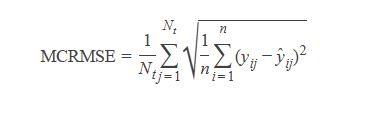

# Capstone Project:


## Udacity Machine Learning Engineer Nanodegree

- Project from the Kaggle competition: [Feedback Prize - English Language Learning](https://www.kaggle.com/competitions/feedback-prize-english-language-learning)
- Field: Natural Language Processing

## Project Overview

From [Kaggle competition page](https://www.kaggle.com/competitions/feedback-prize-english-language-learning) :

Writing is a foundational skill. Sadly, it's one few students are able to hone, often because writing tasks are infrequently assigned in school. A rapidly growing student population, students learning English as a second language, known as English Language Learners (ELLs), are especially affected by the lack of practice. While automated feedback tools make it easier for teachers to assign more writing tasks, they are not designed with ELLs in mind. 

Existing tools are unable to provide feedback based on the language proficiency of the student, resulting in a final evaluation that may be skewed against the learner. Data science may be able to improve automated feedback tools to better support the unique needs of these learners.

Competition host Vanderbilt University is a private research university in Nashville, Tennessee. It offers 70 undergraduate majors and a full range of graduate and professional degrees across 10 schools and colleges, all on a beautiful campus—an accredited arboretum—complete with athletic facilities and state-of-the-art laboratories. Vanderbilt is optimized to inspire and nurture cross-disciplinary research that fosters discoveries that have global impact. Vanderbilt and co-host, The Learning Agency Lab, an independent nonprofit based in Arizona, are focused on developing science of learning-based tools and programs for social good.

Vanderbilt and The Learning Agency Lab have partnered together to offer data scientists the opportunity to support ELLs using data science skills in machine learning, natural language processing, and educational data analytics. You can improve automated feedback tools for ELLs by sensitizing them to language proficiency. The resulting tools could serve teachers by alleviating the grading burden and support ELLs by ensuring their work is evaluated within the context of their current language level.

## Problem Statement 

From [Kaggle competition page](https://www.kaggle.com/competitions/feedback-prize-english-language-learning):

The goal of this competition is to assess the language proficiency of 8th-12th grade English Language Learners (ELLs). Utilizing a dataset of essays written by ELLs will help to develop proficiency models that better supports all students.

Your work will help ELLs receive more accurate feedback on their language development and expedite the grading cycle for teachers. These outcomes could enable ELLs to receive more appropriate learning tasks that will help them improve their English language proficiency.

## Evaluation Metrics

As any other Kaggle competition, submissions will be benchmarked against the test set that are scored using MCRMSE, mean columnwise root mean squared error:

$MCRMSE = \frac{1}{N_{t}} \sum_{j=1}^{N_{t}} \sqrt{\frac{1}{n} \sum_{i=1}^{n}\left(y_{i j}-\hat{y}_{i j}\right)^{2}}$
<!--  -->

where Nt is the number of scored ground truth target columns, and y and $
\hat{y}$  are the actual and predicted values, respectively.

## Project Report

Download the [Project-Report.pdf](./Project-Report.pdf)

### Acquiring the data

Download the data [Kaggle competition page](https://www.kaggle.com/competitions/feedback-prize-english-language-learning).

### Python package requirements

```
 seaborn
 matplotlib
 sklearn
 numpy
 pandas
 nltk
 lightgbm
```


