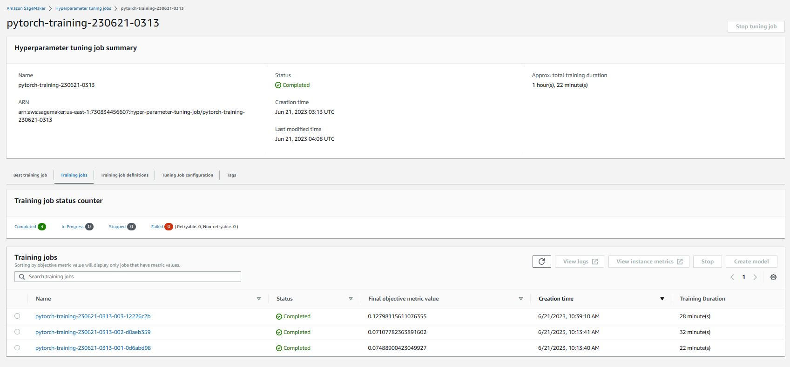
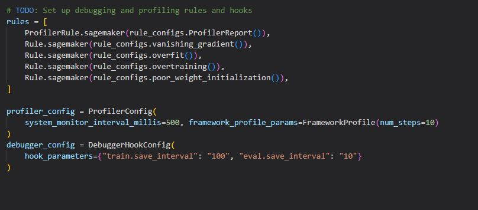

# Image Classification using AWS SageMaker

Use AWS Sagemaker to train a pretrained model that can perform image classification by using the Sagemaker profiling, debugger, hyperparameter tuning and other good ML engineering practices. This can be done on either the provided dog breed classication data set or one of your choice.

## Project Set Up and Installation
Enter AWS through the gateway in the course and open SageMaker Studio. 
Download the starter files.
Download/Make the dataset available. 

## Dataset
The provided dataset is the dogbreed classification dataset which can be found in the classroom.
The project is designed to be dataset independent so if there is a dataset that is more interesting or relevant to your work, you are welcome to use it to complete the project.

### Access
Upload the data to an S3 bucket through the AWS Gateway so that SageMaker has access to the data. 

## Hyperparameter Tuning
What kind of model did you choose for this experiment and why? Give an overview of the types of parameters and their ranges used for the hyperparameter search

I selected ResNet50 as the pretrained model for image recognition. One of its key strengths lies in its ability to perform effectively across diverse datasets and image sizes. A grid search was conducted to determine the optimal learning rate, ranging from 0.005 to 0.01. Additionally, the batch size was varied with options of 32 and 64, while the number of epochs was set to either 2 or 3.

Remember that your README should include:
### A screenshot of completed training jobs

### Logs metrics during the training process

### Tune at least two hyperparameters

### Retrieve the best best hyperparameters from all your training jobs

## Debugging and Profiling
Since we have a training job with best hyperparameters, we directly debug and profile that job with the following configuration:

and put them in estimator instance:

### Results
- The training job started on 06/21/2023 at 07:23:05 and ran for 2094 seconds.
- The piechart shows a breakdown of the CPU/GPU operators. It shows that 100% of training time was spent on executing the "cpu_functions" operator. The most expensive operator on the CPUs was "conv2d" with 19 %
- The StepOutlier rule measures step durations and checks for outliers. The rule returns True if duration is larger than 3 times the standard deviation. The rule has analyzed the step duration from Step:ModeKeys.TRAIN phase. The average step duration on node algo-1-27 was 5.0s. The rule detected 12 outliers, where step duration was larger than 3 times the standard deviation of 2.99s
- Training instance provided 8 CPU cores, however training job only ran on average 1 dataloader workers in parallel. It recommend me to increase the number of dataloader workers. Using pinned memory also improves performance because it enables fast data transfer to CUDA-enabled GPUs. In case of using PyTorch Dataloader, you can enable this by setting pin_memory=True.

## Model Deployment

Once the model is deployed, making a prediction is a straightforward process. I simply need to read the image, feed it into the model, and retrieve the output for each breed. 

