# Operationalizing-an-AWS-ML-Project
## Dog Image Classification
The completed project contains code that trains and deploys an image classification model on AWS Sagemaker. Your goal in this project will be to use several important tools and features of AWS to adjust, improve, configure, and prepare the model you started with for production-grade deployment.

In this project, you will complete the following steps:

1. Train and deploy a model on Sagemaker, using the most appropriate instances. Set up multi-instance training in your Sagemaker notebook.
2. Adjust your Sagemaker notebooks to perform training and deployment on EC2.
3. Set up a Lambda function for your deployed model. Set up auto-scaling for your deployed endpoint as well as concurrency for your Lambda function.
4. Ensure that the security on your ML pipeline is set up properly.

## Step 1: Training and deployment on Sagemaker

- **Created sagemaker notebook instance** 
For creating sagemaker notebook, I used ml.t3.medium because it is a low cost instance and would be sufficient to run my notebook.

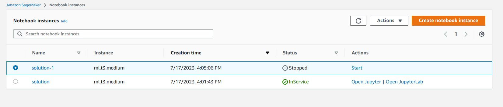

- **S3 bucket for the job** 
I created a bucket name "udacitysolution-1" and upload data into it using the following code:

``` python
!wget https://s3-us-west-1.amazonaws.com/udacity-aind/dog-project/dogImages.zip
!unzip dogImages.zip
!aws s3 cp dogImages s3://udacitysolution/ --recursive
```

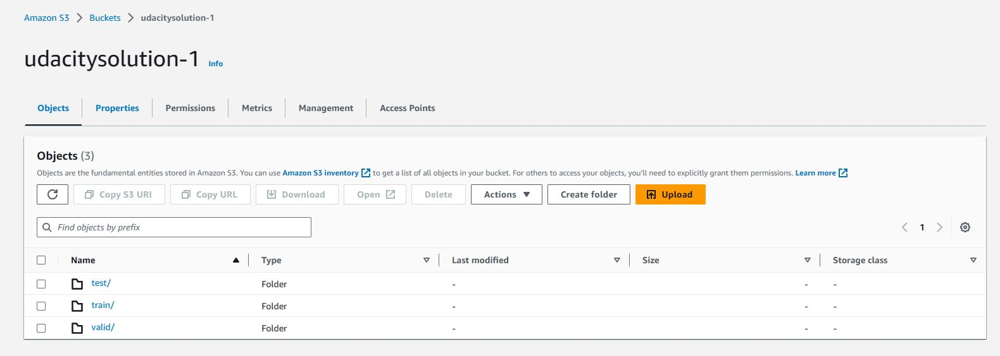


For this model, there are two hyperparameters: learning rate and batch size.
```python
hyperparameter_ranges = {
    "learning_rate": ContinuousParameter(0.001, 0.1),
    "batch_size": CategoricalParameter([32, 64, 128, 256, 512]),
}
```

I used a py script (hpo.py) as entry point to the estimator, this script contains the code need to train model with different hyperparameters values.
```pythonestimator = PyTorch(
    entry_point="hpo.py",
    base_job_name='pytorch_dog_hpo',
    role=role,
    framework_version="1.4.0",
    instance_count=1,
    instance_type="ml.g4dn.xlarge",
    py_version='py3'
)

tuner = HyperparameterTuner(
    estimator,
    objective_metric_name,
    hyperparameter_ranges,
    metric_definitions,
    max_jobs=2,
    max_parallel_jobs=1,  # you once have one ml.g4dn.xlarge instance available
    objective_type=objective_type
)
```

Here I passed some paths to our S3 which will be used by the notebook instance to get data, save model and output

```python
os.environ['SM_CHANNEL_TRAINING']='s3://udacitysolution-1/'
os.environ['SM_MODEL_DIR']='s3://udacitysolution-1/model/'
os.environ['SM_OUTPUT_DATA_DIR']='s3://udacitysolution-1/output/'
tuner.fit({"training": "s3://udacitysolution-1/"})
```

I started the model training we can see the training job status at SageMaker -> Training -> Training Jobs
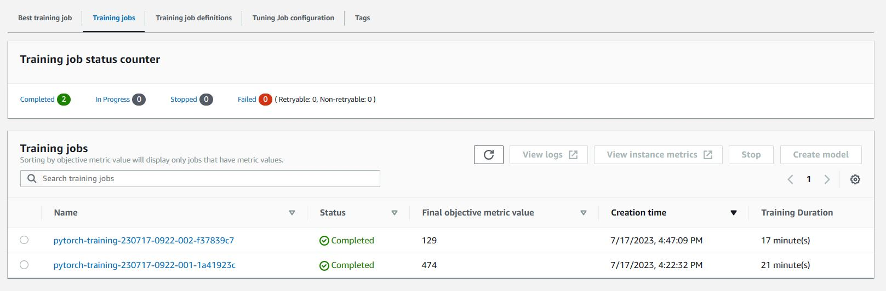

Then I got the best model 
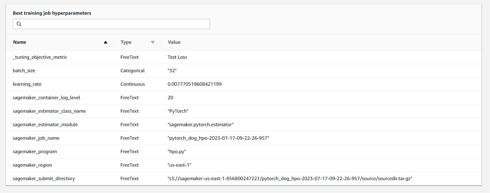


- **Single instance training with best hyperparameters values** 

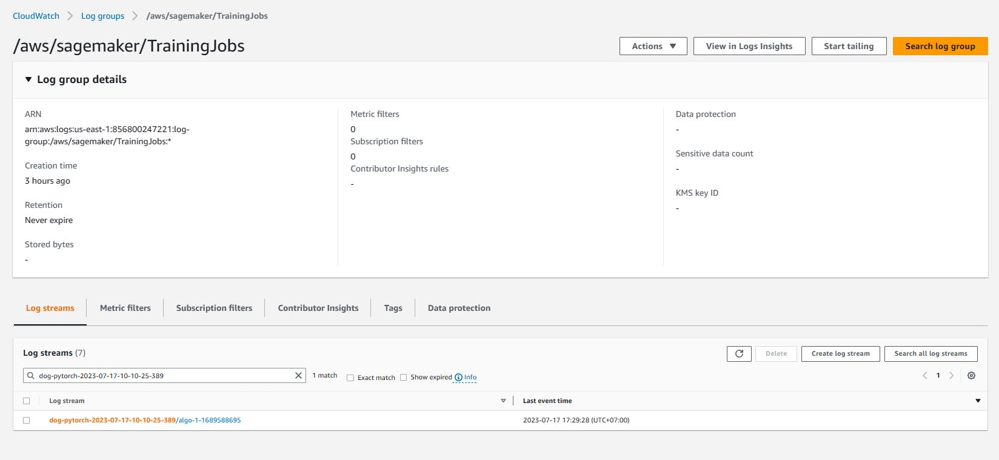

- **Multi-instance training with best hyperparameters values** (4 instances)

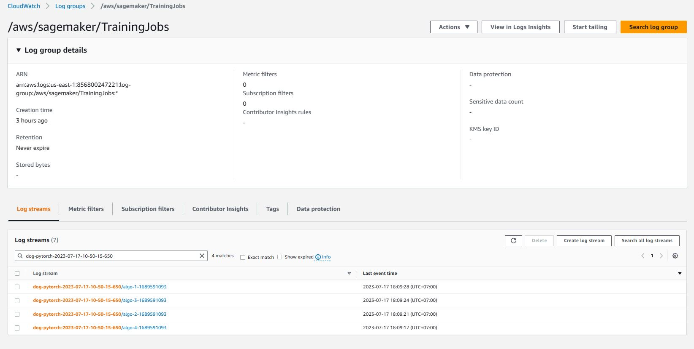
- **Deployment**

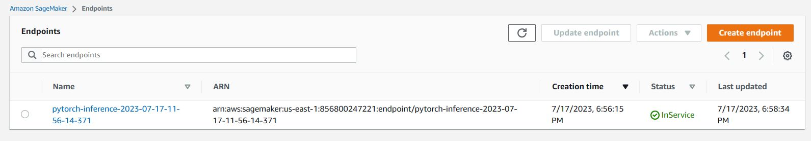


## Step 2: EC2 Training
I chose AMI with "Deep Learning AMI GPU PyTorch 1.13.1" and instance type selected was t2.2xlarge because it is low cost and sufficient to train model.

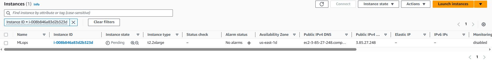

If everything works well we are connected to our instance. The last step is activate pytorch virtual enviroment  on terminal by typing:
```bat
source activate pytorch 
```  
and train model as usually

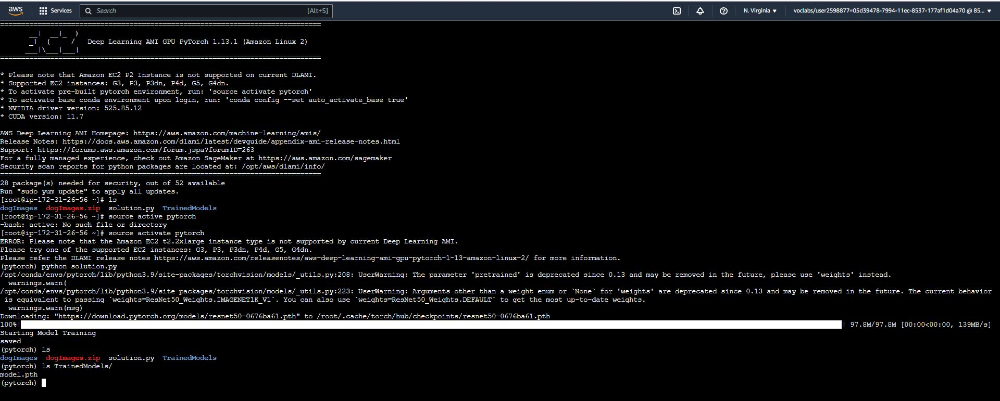

## Step 3: Lambda function setup

After training and deploying your model, setting up a Lambda function is an important next step. Lambda functions enable your model and its inferences to be accessed by API's and other programs, so it's a crucial part of production deployment.

## Step 4: Lambda security setup and testing 

- **Adding endpoints permission to lambda fucntions**
Lambda function is going to invoke deployed endpoint. I create policy with permission to only invoke specific endpoint because if we give "Full Access", it has potential to be exploited by malicous actor .
Two security policy has been attached to the role : 
1. Basic Lambda function execution 
2. Sagemaker endpoint invocation permission

```
 {
    "Version": "2012-10-17",
    "Statement": [
        {
            "Sid": "VisualEditor0",
            "Effect": "Allow",
            "Action": "sagemaker:InvokeEndpoint",
            "Resource": "arn:aws:sagemaker:us-east-1:856800247221:endpoint/pytorch-inference-2023-07-17-11-56-14-371"
        }
    ]
}
```
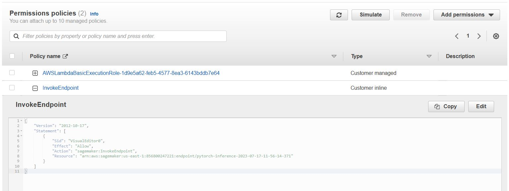

I got the results after running the test with json:
```python
{ "url": "https://s3.amazonaws.com/cdn-origin-etr.akc.org/wp-content/uploads/2017/11/20113314/Carolina-Dog-standing-outdoors.jpg" }
```

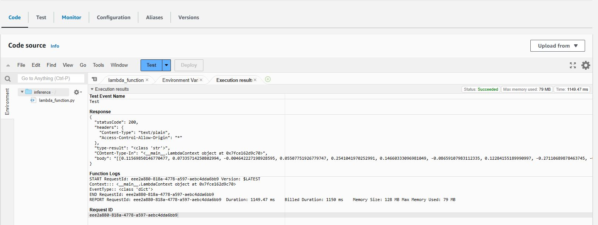

## Step 5: Concurrency and auto-scaling

By default a Lambda Function can only respond one request at once. One way to change that is to use concurrency so that the Lambda Function can be responds to multiple requests at once. 

To set up concurrency on your Lambda function, you will need to open your Lambda function in the Lambda section of AWS. Next, you should open the Configuration tab. Then, you should configure a Version for your function, in the Version section of the Configuration tab.

After configuring a Version for your Lambda function, navigate to the Concurrency section of the Configuration tab of your function. Use this section to configure concurrency for your Lambda function.

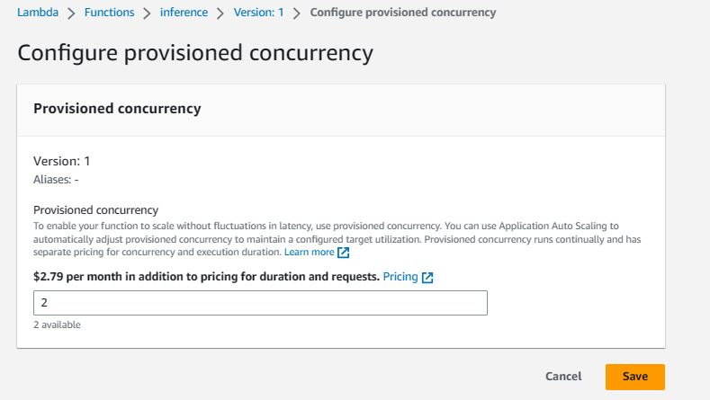

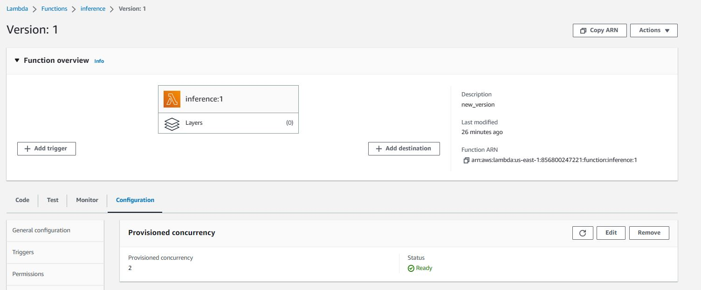

In addition to setting up concurrency for your Lambda function, you should also set up auto-scaling for your deployed endpoint. 

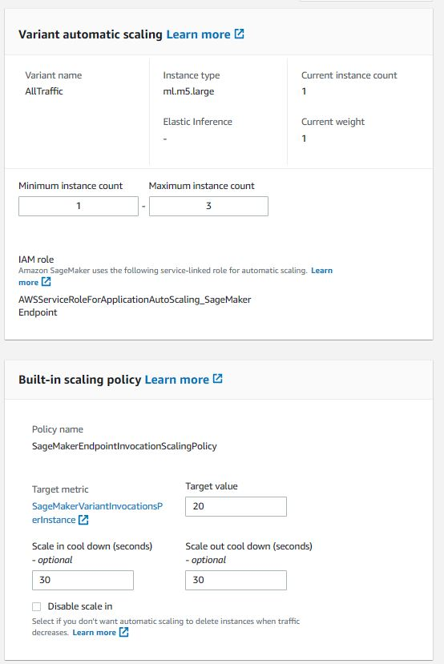

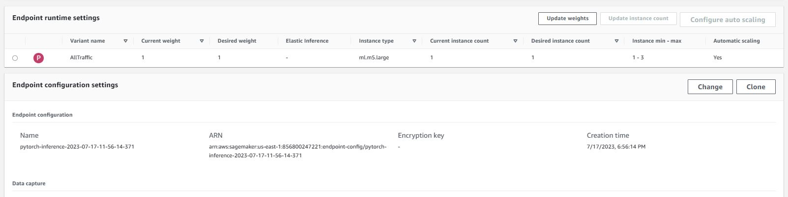